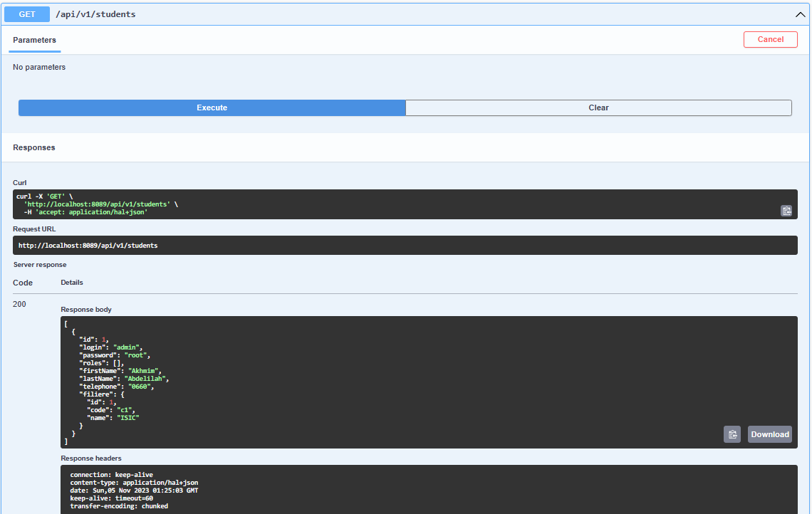
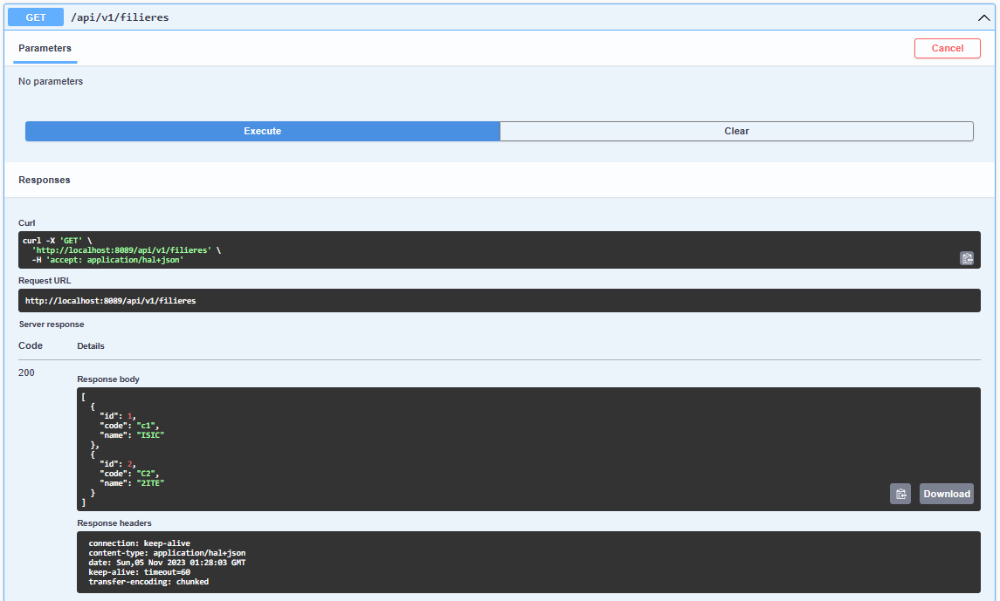
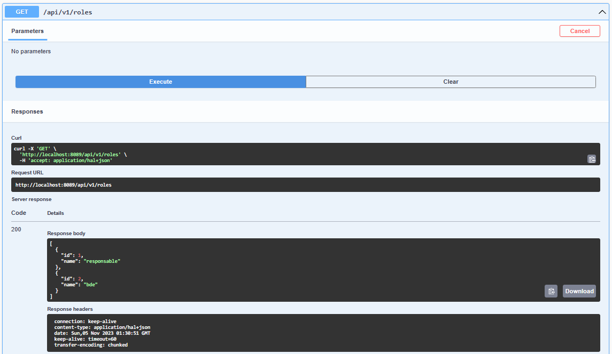
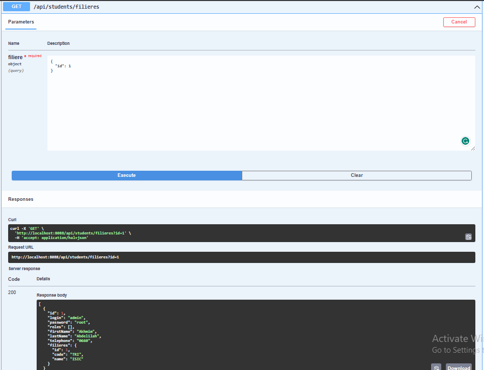

## Projet Java Springboot de Gestion des Etudiants, Filieres et Role ##

- **Gestion des etudiant:**

- **Gestion des filieres:**

- **Gestion des roles:**

- **Affectation des roles:**

- **Affichage des etudiants d'une filiere:**

  
## les fonctionnalités implémentées
1. les operations CRUD pour les deferentes entites
2. Gestion des etudinants
2. Gestion des filieres
2. Gestion des roles
2. Affectation des roles
6. Affichage des etudiants d'une filiere 

  
##Les Technologies Utilisées
+ SpringBoot
+ JPA
+ MySQL
+ Rest Repositories
+ Swagger

"#SpringBoot Project" 

#### Credit by "Akhmim Abdelilah"

