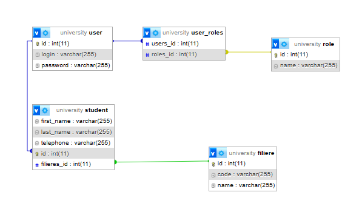

## Projet Java Springboot de Gestion des Etudiants, Filieres et Role ##

##La Conception

- **Gestion des etudiant:**

- **Gestion des filieres:**

- **Gestion des roles:**

- **Affectation des roles:**

- **Affichage des etudiants d'une filiere:**

   

## les fonctionnalités implémentées
1. les operations CRUD pour les deferentes entites
2. Gestion des etudinants
2. Gestion des filieres
2. Gestion des roles
2. Affectation des roles
6. Affichage des etudiants d'une filiere 

  
##Les Technologies Utilisées
+ SpringBoot (Java Framework) 
+ JPA
+ MySQL DB
+ Rest Repositories 
+ Swagger Doc
+ Maven

"#SpringBoot Project" 

#### Credit by "Akhmim Abdelilah"

